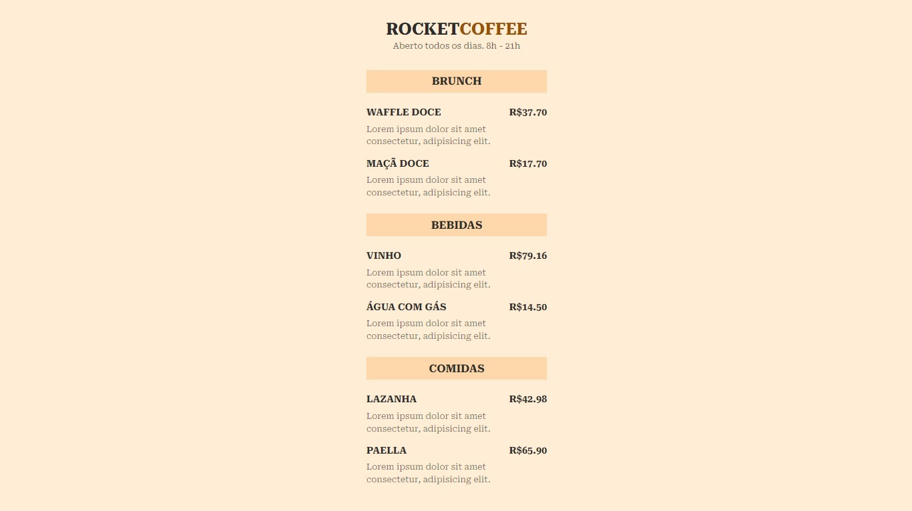

# RocketCoffee

> Tela principal do <i>cardápio digital</i> da cafeteria <strong> RocketCoffee</strong>, apresentando os pratos principais e acompanhamentos do dia.

---

## ⚙️ Funcionalidade

O projeto visa o aprimoramento e desenvolvimento de páginas simples, mas com layouts criativos utilizando-se apenas CSS e HTML.

---

## 🎨 Layout

O layout da aplicação está disponível no Figma:

---

## 💻 Tecnologias utilizadas

* HTML
* CSS

---
## 🔗 Acesse o cardápio virtual

https://therocketcoffee.netlify.app/

---

## 👨🏻‍💻 Desenvolvedor

<!--Idealizador do projeto:-->

<table>
  <tr>
    <td align="center">
      <a href="#">
         
        
          <b>Sergio Cardoso</b>
        
      </a>
    </td>    
  </tr>
</table>

## 📝 Licença

Esse projeto está sob licença. Veja o arquivo [LICENÇA](LICENSE.md) para mais detalhes.

[⬆ Voltar ao topo](#RocketCoffee) 

